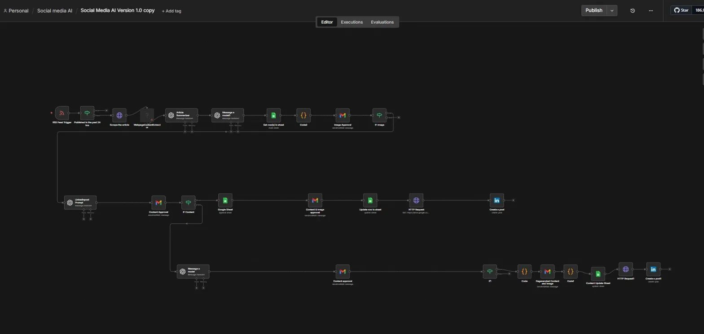

# Social Media AI Agent

A LinkedIn content pipeline I built to stop doing repetitive content work manually.
It watches RSS feeds, picks up trending articles, writes a post, generates an image,
and publishes to LinkedIn — with my approval in between.

## Why I built this

I was spending 2-3 hours every week finding topics, writing posts, and publishing.
This workflow brings that down to a single email click.

## How it works

RSS Feed → scrape article → summarise → generate image → email approval → LinkedIn

1. Watches configured RSS feeds every 24 hours
2. Scrapes the full article from the source URL
3. Sends content to an LLM to summarise and write a LinkedIn post
4. Generates a matching image via image generation API
5. Emails me a draft for review — I approve or reject
6. If approved, publishes post + image + hashtags to LinkedIn
7. If rejected, regenerates with a different angle and sends again

## Stack

- N8N (self-hosted on AWS EC2 with Docker)
- OpenAI API for article summarisation and post writing
- Anthropic Claude API for content review
- LinkedIn API for publishing
- Google Sheets for logging published posts

## Architecture

## What I learned

- How to handle human-in-the-loop approval inside an automated pipeline
- Managing conditional branching when content gets rejected
- Chaining multiple AI calls while keeping context between nodes

---

Made by Sravani — Automation Engineer based in Hyderabad
